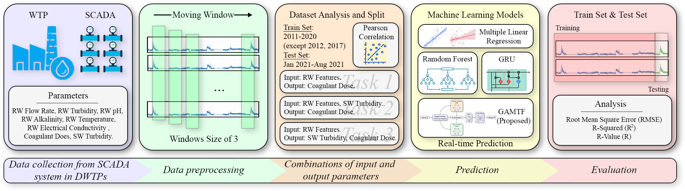
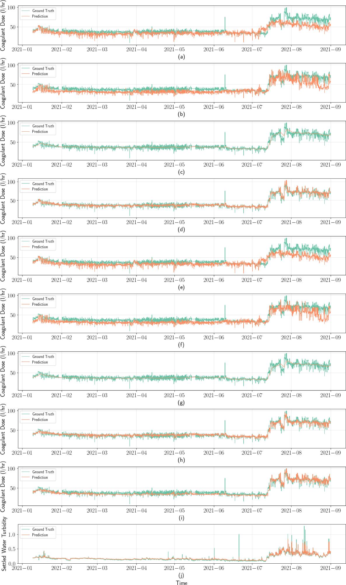

<div align="center">

# :satellite: Coagulant Forecasting

<a href="https://pytorch.org/get-started/locally/"></a>
<a href="https://pytorchlightning.ai/"></a>

[**Quick Start**](#-quick-start) | [**Paper**](https://www.sciencedirect.com/science/article/pii/S0043135423001008) | [**Citation**](#-cite-us)

</div>

The source code of **"[Coagulant dosage determination using deep learning-based graph attention multivariate time series forecasting model](https://www.sciencedirect.com/science/article/pii/S0043135423001008)"** in 2023 [Water Research](https://www.sciencedirect.com/journal/water-research).

## 💡 Introduction

> *Determination of coagulant dosage in water treatment is a time-consuming process involving nonlinear data relationships and numerous factors. This study provides a deep learning approach to determine coagulant dosage and/or the settled water turbidity using long-term data between 2011 and 2021 to include the effect of various weather conditions. A graph attention multivariate time series forecasting (GAMTF) model was developed to determine coagulant dosage and was compared with conventional machine learning and deep learning models. The GAMTF model (R2 = 0.94, RMSE = 3.55) outperformed the other models (R2 = 0.63 - 0.89, RMSE = 4.80 - 38.98), and successfully predicted both coagulant dosage and settled water turbidity simultaneously. The GAMTF model improved the prediction accuracy by considering the hidden interrelationships between features and the past states of features. The results demonstrate the first successful application of multivariate time series deep learning model, especially, a state-of-the-art graph attention-based model, using long-term data for decision-support systems in water treatment processes.*

This repository contains main code for experiments in the paper：*Multiple linear regression* (MLR), LSTM, GRU and *Graph Attention-based Multivariate Time-series Forecasting* **(GAMTF)** models. These models are built using [PyTorch](https://pytorch.org) and experiments are organized by [PyTorch Lightning](https://lightning.ai/pages/open-source/), leading to enhanced efficiency and streamlined development. 



- **Develop Note: 2023.05.01** For using LSTM based models on the minute-based PPM dataset, please use the `notebook/01_lstm.ipynb` notebook. This notebook contains the basic LSTM model for this dataset. For the extended LSTM model (CNN-LSTM and LSTM-Attention), please use the `notebook/02_cnn_lstm.ipynb` and `notebook/03_attention_lstm.ipynb` notebooks.

## 🔧 Quick Start

This code is based on Python. Before using it, please prepare the Python environment according to your operating system.

**Step 1**. [Download](https://github.com/cbhua/model-coagulant-forecast/archive/refs/heads/main.zip) or Clone this repository `git clone git@github.com:cbhua/model-coagulant-forecast.git`;

**Step 2**. Install the required packages by `pip install -r requirements.txt`;
  
**Step 3**. Follow the `data/README.md` to prepare the dataset;
   
**Step 4**. Check jupyter notebooks under `notebook` to see the data processing and step by step guide for running different models;

**Step 5**. To run experiments by script, please check the following steps:
1. You may firstly login your Wandb account in your Python environemnt by following [this guide](https://docs.wandb.ai/quickstart). If you don't want to use the Wandb log, you can modify the `logger` in `pl.Trainer` to `None`, e.g. Line 45 in `scripts/mlp/train.py`;
2. You may want to change the `config.yaml` under each model's folder for your own config.
3. Run `python scripts/<model_name>/train.py` in the root of this repository. For example, launch the trianning for GRU with `python script/gru/train.py`.

We provided some pretrained checkpoints under `checkpoint` for your convinence. You can direclty load them to have a test. 

## ⚙️ File Structure

```
.
├── checkpoint/
│   ├── cnn_lstm_ep10.pt
│   ├── lstm_attention_ep10.pt
│   └── lstm_model_ep10.pt
├── data/
│   ├── ppm_original/ 
│   │   └── ppm.csv
│   ├── ppm_processed/
│   │   ├── datetime.npy
│   │   └── ppm.npy
│   ├── toc_processed
│   └── README.md
├── fig
├── notebook/ - step by step run experiments Jupyter notebooks
│   ├── 00_data_preprocess.ipynb 
│   ├── 01_lstm.ipynb 
│   ├── 02_cnn_lstm.ipynb 
│   └── 03_attention_lstm.ipynb
├── scripts/ - train/valid/test scrips with configuration files
│   ├── gru/
│   │   ├── config.yaml
│   │   └── train.py
│   ├── lstm/
│   │   ├── config.yaml
│   │   └── train.py
│   ├── mlp/
│   │   ├── config.yaml
│   │   └── train.py
│   └── our/
│       ├── config.yaml
│       └── train.py
├── src/
│   ├── datamodule.py
│   ├── dataset.py
│   ├── logger.py
│   ├── model.py
│   └── utils.py
├── README.md
└── requeirements.txt
```

## 📊 Examples

Here is the example results from the paper:

<div align="center"></div>

## 📑 Cite us

If you find this repository is valuable for your research or applied projects:

```bibtex
@article{lin2023coagulant,
  title={Coagulant dosage determination using deep learning-based graph attention multivariate time series forecasting model},
  author={Lin, Subin and Kim, Jiwoong and Hua, Chuanbo and Park, Mi-Hyun and Kang, Seoktae},
  journal={Water Research},
  volume={232},
  pages={119665},
  year={2023},
  publisher={Elsevier}
}
```
